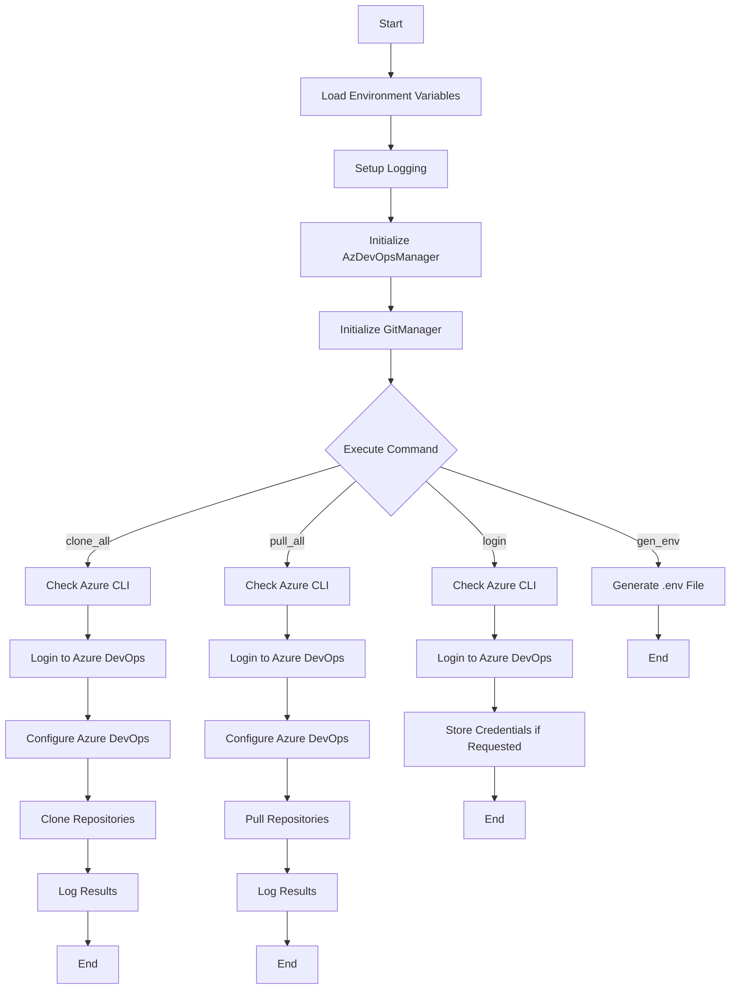

# Azure DevOps CLI Tool Architecture

This document provides the technical architecture and implementation details of the Azure DevOps CLI tool.

## Code Structure

The code is organized into several key components:

1. **Environment and Configuration Management**
2. **Logging Setup**
3. **Azure DevOps Manager**
4. **Git Manager**
5. **CLI Commands**

Each of these components plays a crucial role in the overall functionality of the CLI tool.

## Environment and Configuration Management

The code begins by loading environment variables using the `dotenv` library. These variables include essential configuration details such as the Azure DevOps organization URL and personal access token (PAT). Default values are provided for these variables, ensuring that the tool can function even if some environment variables are not explicitly set.

```python
DEFAULT_VALUES = {
    "AZURE_DEVOPS_ORG_URL": "https://www.visualstudio.com",
    "AZURE_DEVOPS_EXT_PAT": "<your-pat-token>",
    "LOG_FILENAME": "ado-cli.log",
    "LOG_LEVEL": "DEBUG",
    "CON_LEVEL": "INFO",
}

load_dotenv(
    dotenv_path=None,
    verbose=True,
    override=True,
)
```

## Logging Setup

Logging is a critical aspect of this CLI tool, providing insights into its operations and aiding in debugging. The code uses Python's `logging` module, enhanced with `RichHandler` from the `rich` library for better console output. A custom formatter, `AdoCliFormatter`, is implemented to sanitize logs by removing sensitive information such as PATs from URLs.

```python
class AdoCliFormatter(logging.Formatter):
    """Formatter that removes PAT from the URL in logs."""
    ...
```

The logging setup includes both file and console handlers, with configurable log levels.

## Azure DevOps Manager

The `AzDevOpsManager` class encapsulates functionality related to Azure DevOps operations. It includes methods to check if the Azure CLI and its DevOps extension are installed, log into Azure DevOps using a PAT, and configure default settings for the organization and project.

```python
class AzDevOpsManager:
    def __init__(self):
        self.ado_org = os.getenv(
            "AZURE_DEVOPS_ORG_URL",
            DEFAULT_VALUES["AZURE_DEVOPS_ORG_URL"],
        )
        self.ado_pat = os.getenv(
            "AZURE_DEVOPS_EXT_PAT",
            DEFAULT_VALUES["AZURE_DEVOPS_EXT_PAT"],
        )
    ...
```

### Key Methods

- **check_az_cli_installed**: Verifies the installation of the Azure CLI.
- **ensure_ado_ext_installed**: Ensures the Azure DevOps extension is installed.
- **is_logged_into_az_devops**: Checks if the user is logged into Azure DevOps.
- **login_to_az_devops**: Logs into Azure DevOps using the provided PAT.
- **configure_az_devops**: Configures default organization and project settings.

## Git Manager

The `GitManager` class handles Git operations such as cloning and pulling repositories. It uses asynchronous methods to perform these operations, allowing for concurrent execution and improved performance.

```python
class GitManager:
    GIT_EXECUTABLE = "git"

    async def git_clone(
        self, repo_url: str, output_dir: Path
    ):
        ...
```

### Key Methods

- **git_clone**: Clones a repository into a specified directory.
- **git_pull**: Pulls the latest changes for an existing repository.
- **_run_subprocess**: A helper method to execute shell commands asynchronously.

## Authentication

The tool supports multiple authentication methods for Azure DevOps:

1. **Environment Variables**: Set `AZURE_DEVOPS_ORG_URL` and `AZURE_DEVOPS_EXT_PAT` in your environment
2. **Login Command**: Use the interactive `login` command to authenticate and optionally store credentials
3. **Dotenv File**: Create a `.env` file in the project directory with your credentials

The login process is resilient, with multiple fallback mechanisms:
- Environment variable-based authentication (most reliable)
- Explicit credential storage using Azure CLI
- Basic auth via request headers

## Security Implementation

The tool takes security seriously:
- PATs are never exposed in logs or console output
- Credential files have restricted permissions (0600)
- Support for multiple authentication methods to suit different security requirements
- Self-cleanup of sensitive information in memory

## Command Flow

The following mermaid diagram illustrates the flow of operations within the CLI tool:



## Future Improvements

### 1. Enhanced Error Handling

**Summary:** 
Implement more granular error handling strategies with custom exception classes for different error scenarios.

**Approach:**
- Define custom exception classes for different error scenarios
- Categorize errors into recoverable and non-recoverable
- Improve logging to include error categories and potential solutions

### 2. Configuration Management

**Summary:** 
Introduce a profile-based configuration management system to support multiple environments or projects.

**Approach:**
- Use JSON/YAML for configuration profiles
- Implement CLI commands to manage profiles
- Allow fallback to environment variables when needed

### 3. Improved Asynchronous Operations

**Summary:** 
Optimize task scheduling and execution for better performance with large repositories.

**Approach:**
- Implement a task queue for better control over concurrency
- Add resource limits to prevent system overload
- Integrate improved error handling within async operations

### 4. User Interface Enhancements

**Summary:** 
Enhance the CLI interface with better progress indicators and interactive prompts.

**Approach:**
- Use Rich library for advanced progress bars
- Add interactive confirmation for critical operations
- Improve help message organization

### 5. Comprehensive Testing Suite

**Summary:** 
Create a testing suite with unit, integration, and end-to-end tests.

**Approach:**
- Use pytest for testing framework
- Implement mocking and stubbing for external dependencies
- Integrate with CI/CD for automated testing

## Conclusion

The Azure DevOps CLI tool is a well-structured application that leverages modern Python libraries to provide a robust interface for managing Azure DevOps repositories. It efficiently handles authentication, environment configuration, logging, and asynchronous operations, making it a valuable tool for developers and DevOps engineers.