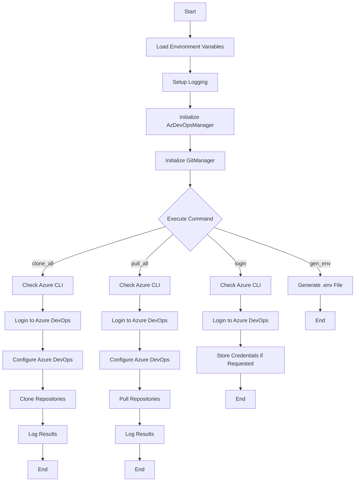
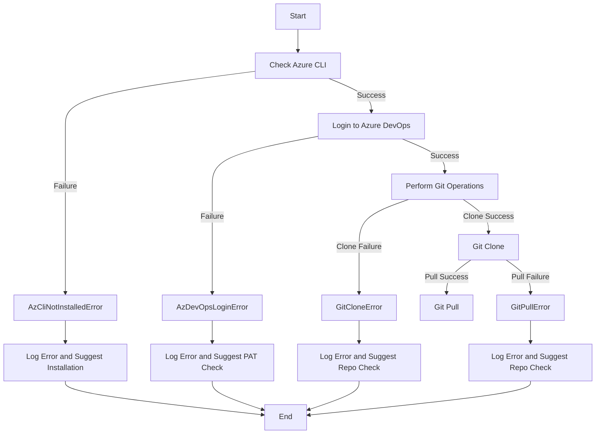
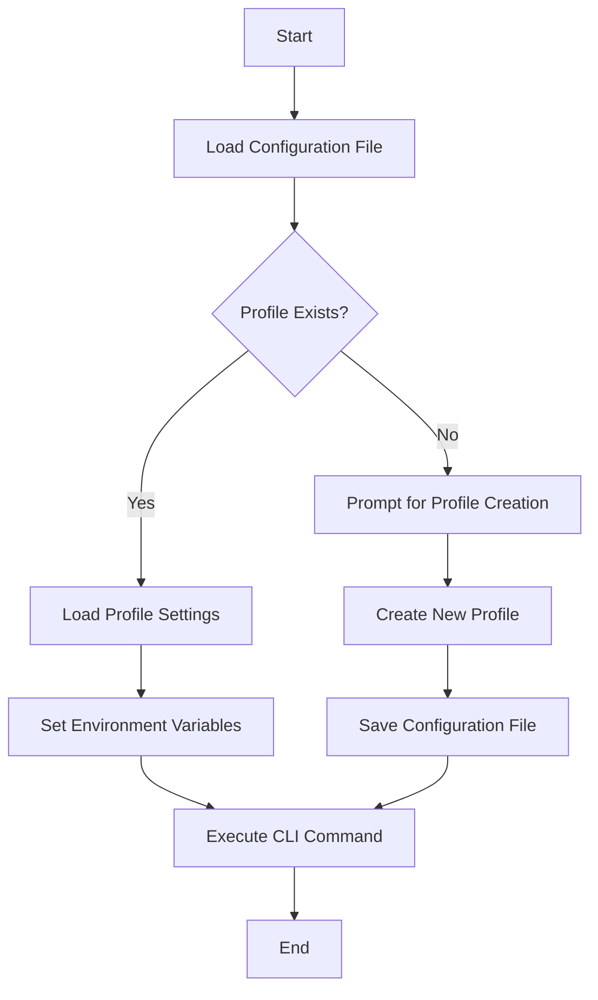
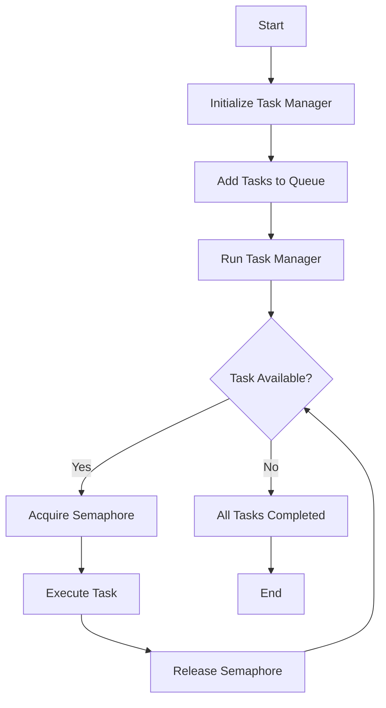
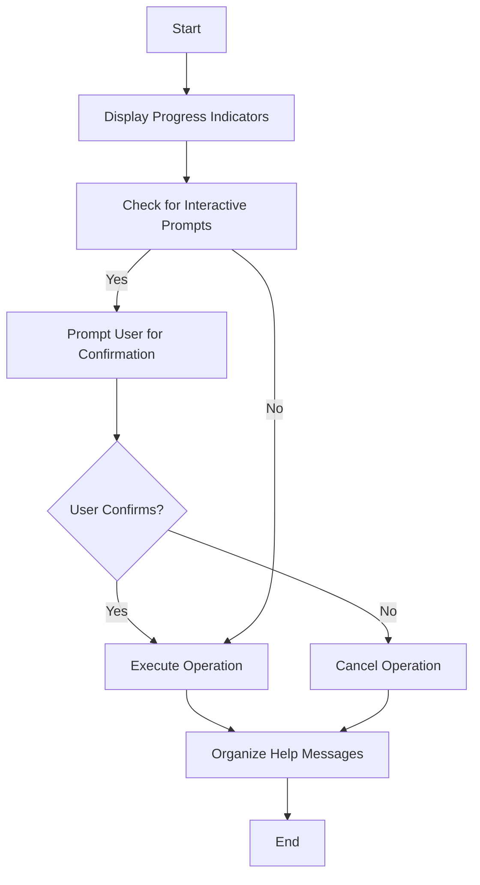
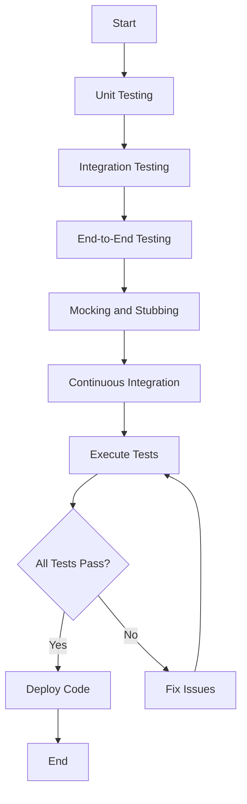

# Azure DevOps CLI Tool

## Overview

This command-line interface (CLI) tool is designed to interact with Azure DevOps services. It facilitates operations such as logging in to Azure DevOps, cloning all repositories from a project, pulling updates for all repositories, and generating environment configuration files. The tool is built using Python and leverages several libraries including `typer` for CLI command handling, `asyncio` for asynchronous operations, and `subprocess` for executing shell commands.

## Code Structure

The code is organized into several key components:

1. **Environment and Configuration Management**
2. **Logging Setup**
3. **Azure DevOps Manager**
4. **Git Manager**
5. **CLI Commands**

Each of these components plays a crucial role in the overall functionality of the CLI tool.

## Environment and Configuration Management

The code begins by loading environment variables using the `dotenv` library. These variables include essential configuration details such as the Azure DevOps organization URL and personal access token (PAT). Default values are provided for these variables, ensuring that the tool can function even if some environment variables are not explicitly set.

```python
DEFAULT_VALUES = {
    "AZURE_DEVOPS_ORG_URL": "https://www.visualstudio.com",
    "AZURE_DEVOPS_EXT_PAT": "<your-pat-token>",
    "LOG_FILENAME": "ado-cli.log",
    "LOG_LEVEL": "DEBUG",
    "CON_LEVEL": "INFO",
}

load_dotenv(
    dotenv_path=None,
    verbose=True,
    override=True,
)
```

## Logging Setup

Logging is a critical aspect of this CLI tool, providing insights into its operations and aiding in debugging. The code uses Python's `logging` module, enhanced with `RichHandler` from the `rich` library for better console output. A custom formatter, `AdoCliFormatter`, is implemented to sanitize logs by removing sensitive information such as PATs from URLs.

```python
class AdoCliFormatter(logging.Formatter):
    """Formatter that removes PAT from the URL in logs."""
    ...
```

The logging setup includes both file and console handlers, with configurable log levels.

## Azure DevOps Manager

The `AzDevOpsManager` class encapsulates functionality related to Azure DevOps operations. It includes methods to check if the Azure CLI and its DevOps extension are installed, log into Azure DevOps using a PAT, and configure default settings for the organization and project.

```python
class AzDevOpsManager:
    def __init__(self):
        self.ado_org = os.getenv(
            "AZURE_DEVOPS_ORG_URL",
            DEFAULT_VALUES["AZURE_DEVOPS_ORG_URL"],
        )
        self.ado_pat = os.getenv(
            "AZURE_DEVOPS_EXT_PAT",
            DEFAULT_VALUES["AZURE_DEVOPS_EXT_PAT"],
        )
    ...
```

### Key Methods

- **check_az_cli_installed**: Verifies the installation of the Azure CLI.
- **ensure_ado_ext_installed**: Ensures the Azure DevOps extension is installed.
- **is_logged_into_az_devops**: Checks if the user is logged into Azure DevOps.
- **login_to_az_devops**: Logs into Azure DevOps using the provided PAT.
- **configure_az_devops**: Configures default organization and project settings.

## Git Manager

The `GitManager` class handles Git operations such as cloning and pulling repositories. It uses asynchronous methods to perform these operations, allowing for concurrent execution and improved performance.

```python
class GitManager:
    GIT_EXECUTABLE = "git"

    async def git_clone(
        self, repo_url: str, output_dir: Path
    ):
        ...
```

### Key Methods

- **git_clone**: Clones a repository into a specified directory.
- **git_pull**: Pulls the latest changes for an existing repository.
- **_run_subprocess**: A helper method to execute shell commands asynchronously.

## CLI Commands

The CLI tool is built using `typer`, which simplifies the creation of command-line interfaces. The tool provides several commands, each corresponding to a specific operation.

### login Command

This command allows users to authenticate with Azure DevOps using a Personal Access Token (PAT). It provides interactive prompts if credentials are not provided, and can store them securely for future use.

```bash
# Login with prompts for organization URL and PAT
python ado-cli.py login

# Login with explicitly provided credentials
python ado-cli.py login --org https://dev.azure.com/your-org --pat your-pat-token

# Login without storing credentials
python ado-cli.py login --no-store
```

### clone_all Command

This command clones all repositories from a specified Azure DevOps project into a local directory. It supports various update modes, allowing users to skip, pull, or force clone repositories.

```bash
# Clone all repos from a project
python ado-cli.py clone-all project-name ./repos

# Clone with 8 concurrent operations and force mode (overwrite existing repos)
python ado-cli.py clone-all project-name ./repos -c 8 -u force
```

### pull_all Command

The `pull_all` command updates all repositories in a specified directory by pulling the latest changes from Azure DevOps.

```bash
# Pull latest changes for all repos
python ado-cli.py pull-all project-name ./repos
```

### gen_env Command

This command generates an environment file with the necessary configuration variables, using existing values if available.

```bash
# Generate environment file
python ado-cli.py gen-env
```

## Flow Diagram

Below is a mermaid diagram illustrating the flow of operations within the CLI tool:



## Authentication

The tool supports multiple authentication methods for Azure DevOps:

1. **Environment Variables**: Set `AZURE_DEVOPS_ORG_URL` and `AZURE_DEVOPS_EXT_PAT` in your environment
2. **Login Command**: Use the interactive `login` command to authenticate and optionally store credentials
3. **Dotenv File**: Create a `.env` file in the project directory with your credentials

The login process is resilient, with multiple fallback mechanisms:
- Environment variable-based authentication (most reliable)
- Explicit credential storage using Azure CLI
- Basic auth via request headers

## Security

The tool takes security seriously:
- PATs are never exposed in logs or console output
- Credential files have restricted permissions (0600)
- Support for multiple authentication methods to suit different security requirements
- Self-cleanup of sensitive information in memory

## Conclusion

The Azure DevOps CLI tool is a well-structured application that leverages modern Python libraries to provide a robust interface for managing Azure DevOps repositories. It efficiently handles authentication, environment configuration, logging, and asynchronous operations, making it a valuable tool for developers and DevOps engineers. The use of `typer` for command handling and `asyncio` for concurrent operations demonstrates a modern approach to building CLI applications in Python.
# Improvements Addendum

In this section, we will outline potential improvements to the Azure DevOps CLI codebase. These improvements are prioritized based on their impact on usability, maintainability, and performance. Each improvement is explained in a way that is accessible to both software developers and subject matter experts.

## Improvement Addendum 1: Enhanced Error Handling

**Summary:** 
The current error handling in the codebase primarily relies on logging errors and exiting the application using `typer.Exit`. While this approach provides immediate feedback, it can be improved by implementing more granular error handling strategies. This would involve catching specific exceptions and providing more informative error messages or recovery options.

**Importance:** 
Enhanced error handling improves the user experience by providing clearer guidance on how to resolve issues. It also aids in debugging and reduces the likelihood of abrupt application termination, which can be disruptive in automated workflows.

## Improvement Addendum 2: Configuration Management

**Summary:** 
The tool currently uses environment variables for configuration, which can be cumbersome to manage, especially in environments with multiple users or projects. Introducing a configuration management system that supports multiple profiles or configuration files would allow users to easily switch between different settings.

**Importance:** 
Improved configuration management enhances flexibility and usability, making the tool more adaptable to different environments and use cases. It also simplifies the setup process for new users and reduces the potential for configuration errors.

## Improvement Addendum 3: Improved Asynchronous Operations

**Summary:** 
While the tool uses `asyncio` for asynchronous operations, there is room for optimization. For instance, implementing a more sophisticated task scheduling mechanism could improve performance, especially when dealing with a large number of repositories.

**Importance:** 
Optimizing asynchronous operations can significantly reduce the time taken to clone or pull repositories, particularly in large projects. This improvement would enhance the tool's efficiency and scalability, making it more suitable for enterprise environments.

## Improvement Addendum 4: User Interface Enhancements

**Summary:** 
The current CLI interface is functional but could benefit from enhancements such as more detailed progress indicators, interactive prompts, and better-organized help messages. These improvements would make the tool more user-friendly and accessible.

**Importance:** 
A more intuitive user interface can lower the learning curve for new users and improve overall satisfaction. It also helps in reducing errors by providing clearer instructions and feedback during operations.

## Improvement Addendum 5: Comprehensive Testing Suite

**Summary:** 
The codebase would benefit from a comprehensive testing suite that includes unit tests, integration tests, and end-to-end tests. This would ensure that all components of the tool function correctly and that new features or changes do not introduce regressions.

**Importance:** 
A robust testing suite is crucial for maintaining code quality and reliability. It facilitates continuous integration and deployment processes and provides confidence that the tool will perform as expected in various scenarios.

## Improvement Addendum 6: Documentation and Examples

**Summary:** 
While the codebase includes some inline documentation, a more extensive set of user guides, examples, and API documentation would be beneficial. This could include tutorials for common tasks, detailed explanations of command options, and example configuration files.

**Importance:** 
Comprehensive documentation is essential for user adoption and support. It empowers users to fully utilize the tool's capabilities and reduces the need for external support. Well-documented code also aids in onboarding new developers and contributors to the project.
# Improvement Addendum 1: Enhanced Error Handling

## Overview

The current error handling strategy in the Azure DevOps CLI tool primarily involves logging errors and exiting the application using `typer.Exit`. While this approach provides immediate feedback, it can be improved by implementing more granular error handling strategies. This section details the design, architecture, and code changes required to enhance error handling in the tool.

## Design and Architecture

### Objectives

1. **Granular Error Handling:** Implement specific exception handling to provide more informative error messages and recovery options.
2. **User Feedback:** Enhance user feedback by categorizing errors and suggesting possible solutions.
3. **Resilience:** Increase the tool's resilience by allowing it to recover from certain errors without terminating.

### Approach

- **Custom Exception Classes:** Define custom exception classes for different error scenarios. This allows for more precise error handling and messaging.
- **Error Categorization:** Categorize errors into recoverable and non-recoverable, providing appropriate responses for each.
- **Logging Enhancements:** Improve logging to include error categories and potential solutions.

## Code Changes

### Custom Exception Classes

Define custom exception classes to represent specific error conditions.

```python
class AzDevOpsError(Exception):
    """Base class for Azure DevOps related errors."""
    pass

class AzCliNotInstalledError(AzDevOpsError):
    """Raised when Azure CLI is not installed."""
    pass

class AzDevOpsLoginError(AzDevOpsError):
    """Raised when login to Azure DevOps fails."""
    pass

class GitOperationError(Exception):
    """Base class for Git operation errors."""
    pass

class GitCloneError(GitOperationError):
    """Raised when a Git clone operation fails."""
    pass

class GitPullError(GitOperationError):
    """Raised when a Git pull operation fails."""
    pass
```

### Error Handling in Azure DevOps Manager

Enhance error handling in the `AzDevOpsManager` class by using custom exceptions.

```python
class AzDevOpsManager:
    ...
    def check_az_cli_installed(self):
        logger.debug("Checking if Azure CLI is installed...")
        try:
            proc = subprocess.run(
                ["az", "version", "--output", "json"],
                capture_output=True,
                text=True,
                check=True,
            )
            json.loads(proc.stdout)
            logger.debug("Azure CLI is installed and functioning: %s", proc.stdout)
        except subprocess.CalledProcessError:
            logger.error("Azure CLI is not installed or not functioning correctly.")
            raise AzCliNotInstalledError("Azure CLI is required but not installed.")

    def login_to_az_devops(self, organization: str, pat: str):
        logger.info("Logging in to Azure DevOps with PAT to organization: %s", organization)
        proc = subprocess.run(
            [
                "az",
                "devops",
                "login",
                "--organization",
                organization,
                "--verbose",
            ],
            input=pat,
            text=True,
            capture_output=True,
        )
        if proc.returncode != 0:
            logger.error("Failed to login to Azure DevOps. Output: %s", proc.stderr.strip())
            raise AzDevOpsLoginError("Failed to login to Azure DevOps. Please check your PAT and organization URL.")
        else:
            logger.info("Logged in to Azure DevOps successfully.")
            logger.debug("Output: %s", proc.stdout.strip())
```

### Error Handling in Git Manager

Enhance error handling in the `GitManager` class by using custom exceptions.

```python
class GitManager:
    ...
    async def git_clone(self, repo_url: str, output_dir: Path):
        logger.info(f"Cloning repository: {repo_url} into {output_dir}")
        cmd = [self.GIT_EXECUTABLE, "clone", repo_url]
        try:
            await self._run_subprocess(cmd, cwd=output_dir)
        except subprocess.CalledProcessError:
            logger.error(f"Failed to clone repository: {repo_url}")
            raise GitCloneError(f"Failed to clone repository: {repo_url}")

    async def git_pull(self, repo_dir: Path):
        logger.info(f"Pulling repository in: {repo_dir}")
        cmd = [self.GIT_EXECUTABLE, "pull"]
        try:
            await self._run_subprocess(cmd, cwd=repo_dir)
        except subprocess.CalledProcessError:
            logger.error(f"Failed to pull repository in: {repo_dir}")
            raise GitPullError(f"Failed to pull repository in: {repo_dir}")
```

### Error Handling Flow Diagram

The following mermaid diagram illustrates the enhanced error handling flow:



## Conclusion

By implementing enhanced error handling, the Azure DevOps CLI tool can provide more informative feedback to users, improve resilience, and offer potential recovery options for certain errors. This improvement not only enhances the user experience but also aids in debugging and maintaining the tool.
# Improvement Addendum 2: Configuration Management

## Overview

The current Azure DevOps CLI tool relies on environment variables for configuration, which can be cumbersome to manage, especially in environments with multiple users or projects. This improvement focuses on introducing a configuration management system that supports multiple profiles or configuration files, allowing users to easily switch between different settings.

## Design and Architecture

### Objectives

1. **Profile-Based Configuration:** Implement a system that allows users to define multiple configuration profiles.
2. **Configuration Files:** Use configuration files to store settings, reducing reliance on environment variables.
3. **Ease of Use:** Provide commands to manage profiles, such as creating, listing, and switching profiles.

### Approach

- **Configuration File Format:** Use a common format like JSON or YAML for configuration files to ensure readability and ease of editing.
- **Profile Management Commands:** Implement CLI commands to manage configuration profiles.
- **Fallback Mechanism:** Allow environment variables to override configuration file settings if needed.

## Code Changes

### Configuration File Structure

Define a JSON structure for configuration files, allowing users to specify multiple profiles.

```json
{
    "profiles": {
        "default": {
            "AZURE_DEVOPS_ORG_URL": "https://dev.azure.com/your-org",
            "AZURE_DEVOPS_EXT_PAT": "your-pat-token"
        },
        "profile1": {
            "AZURE_DEVOPS_ORG_URL": "https://dev.azure.com/another-org",
            "AZURE_DEVOPS_EXT_PAT": "another-pat-token"
        }
    }
}
```

### Configuration Management Class

Implement a class to handle loading and managing configuration profiles.

```python
import json
from pathlib import Path

class ConfigManager:
    CONFIG_FILE = Path.home() / ".ado_cli_config.json"

    def __init__(self):
        self.config = self.load_config()

    def load_config(self):
        if self.CONFIG_FILE.exists():
            with open(self.CONFIG_FILE, "r", encoding="utf-8") as f:
                return json.load(f)
        else:
            return {"profiles": {}}

    def save_config(self):
        with open(self.CONFIG_FILE, "w", encoding="utf-8") as f:
            json.dump(self.config, f, indent=4)

    def get_profile(self, profile_name="default"):
        return self.config["profiles"].get(profile_name, {})

    def set_profile(self, profile_name, settings):
        self.config["profiles"][profile_name] = settings
        self.save_config()

    def list_profiles(self):
        return list(self.config["profiles"].keys())
```

### CLI Commands for Profile Management

Add commands to manage configuration profiles.

```python
@app.command(help="List available configuration profiles.")
def list_profiles():
    config_manager = ConfigManager()
    profiles = config_manager.list_profiles()
    console.print("Available profiles:")
    for profile in profiles:
        console.print(f" - {profile}")

@app.command(help="Set a configuration profile.")
def set_profile(
    profile_name: str = typer.Argument(..., help="Profile name."),
    org_url: str = typer.Option(..., help="Azure DevOps organization URL."),
    pat: str = typer.Option(..., help="Personal Access Token.")
):
    config_manager = ConfigManager()
    config_manager.set_profile(profile_name, {
        "AZURE_DEVOPS_ORG_URL": org_url,
        "AZURE_DEVOPS_EXT_PAT": pat
    })
    console.print(f"Profile '{profile_name}' set successfully.")

@app.command(help="Use a configuration profile.")
def use_profile(
    profile_name: str = typer.Argument(..., help="Profile name.")
):
    config_manager = ConfigManager()
    profile = config_manager.get_profile(profile_name)
    if not profile:
        console.print(f"Profile '{profile_name}' not found.")
        raise typer.Exit(code=1)

    os.environ["AZURE_DEVOPS_ORG_URL"] = profile["AZURE_DEVOPS_ORG_URL"]
    os.environ["AZURE_DEVOPS_EXT_PAT"] = profile["AZURE_DEVOPS_EXT_PAT"]
    console.print(f"Profile '{profile_name}' is now active.")
```

### Configuration Management Flow Diagram

The following mermaid diagram illustrates the configuration management flow:



## Conclusion

By implementing a configuration management system with profile support, the Azure DevOps CLI tool becomes more flexible and user-friendly. Users can easily manage multiple configurations, reducing the complexity of switching between different environments or projects. This improvement enhances the tool's usability and adaptability, making it more suitable for diverse use cases.
# Improvement Addendum 3: Improved Asynchronous Operations

## Overview

The Azure DevOps CLI tool currently uses `asyncio` for asynchronous operations, which allows for concurrent execution of tasks such as cloning and pulling repositories. However, there is room for optimization in task scheduling and execution to further improve performance, especially when dealing with a large number of repositories.

## Design and Architecture

### Objectives

1. **Optimized Task Scheduling:** Implement a more efficient task scheduling mechanism to manage concurrent operations.
2. **Resource Management:** Ensure optimal use of system resources to prevent bottlenecks and improve throughput.
3. **Scalability:** Enhance the tool's ability to handle a large number of repositories efficiently.

### Approach

- **Task Queue:** Use a task queue to manage and schedule tasks, allowing for better control over concurrency levels.
- **Resource Limits:** Implement resource limits to prevent overloading the system, such as limiting the number of concurrent network connections.
- **Error Handling:** Integrate improved error handling within asynchronous operations to manage failures gracefully.

## Code Changes

### Task Queue Implementation

Implement a task queue to manage asynchronous operations.

```python
import asyncio
from asyncio import Queue

class AsyncTaskManager:
    def __init__(self, concurrency_limit):
        self.concurrency_limit = concurrency_limit
        self.queue = Queue()
        self.semaphore = asyncio.Semaphore(concurrency_limit)

    async def worker(self):
        while True:
            task = await self.queue.get()
            try:
                await task()
            except Exception as e:
                logger.error(f"Task failed with error: {e}")
            finally:
                self.queue.task_done()

    async def add_task(self, task):
        await self.queue.put(task)

    async def run(self):
        workers = [asyncio.create_task(self.worker()) for _ in range(self.concurrency_limit)]
        await self.queue.join()
        for worker in workers:
            worker.cancel()
```

### Integration with Git Operations

Integrate the task queue with Git operations to manage cloning and pulling tasks.

```python
async def clone_repo(git_manager, repo_url, output_dir):
    try:
        await git_manager.git_clone(repo_url, output_dir)
    except GitCloneError as e:
        logger.error(f"Failed to clone {repo_url}: {e}")

async def pull_repo(git_manager, repo_dir):
    try:
        await git_manager.git_pull(repo_dir)
    except GitPullError as e:
        logger.error(f"Failed to pull {repo_dir}: {e}")

async def process_repositories(git_manager, repos, output_dir, concurrency_limit):
    task_manager = AsyncTaskManager(concurrency_limit)
    for repo in repos:
        repo_url = repo["Url"]
        repo_name = repo["Name"]
        repo_dir = output_dir / repo_name
        if not repo_dir.exists():
            await task_manager.add_task(lambda: clone_repo(git_manager, repo_url, output_dir))
        else:
            await task_manager.add_task(lambda: pull_repo(git_manager, repo_dir))
    await task_manager.run()
```

### Improved Asynchronous Operations Flow Diagram

The following mermaid diagram illustrates the improved asynchronous operations flow:



## Conclusion

By implementing a task queue and optimizing asynchronous operations, the Azure DevOps CLI tool can handle a larger number of repositories more efficiently. This improvement enhances the tool's scalability and performance, ensuring that it can manage concurrent operations without overwhelming system resources. The integration of improved error handling within asynchronous tasks also contributes to a more robust and resilient application.
# Improvement Addendum 4: User Interface Enhancements

## Overview

The current CLI interface of the Azure DevOps tool is functional but could benefit from enhancements such as more detailed progress indicators, interactive prompts, and better-organized help messages. These improvements aim to make the tool more user-friendly and accessible.

## Design and Architecture

### Objectives

1. **Enhanced Progress Indicators:** Provide detailed progress feedback during operations to keep users informed.
2. **Interactive Prompts:** Implement interactive prompts for critical operations to confirm user intentions.
3. **Organized Help Messages:** Improve the organization and clarity of help messages to assist users in understanding command options.

### Approach

- **Rich Progress Bars:** Utilize the `rich` library to implement advanced progress bars that display detailed information about ongoing operations.
- **Interactive Confirmation:** Use `typer`'s confirmation prompts for operations that could result in data loss or significant changes.
- **Help Message Structuring:** Organize help messages with clear descriptions and examples for each command.

## Code Changes

### Enhanced Progress Indicators

Implement detailed progress indicators using the `rich` library.

```python
from rich.progress import Progress, BarColumn, TextColumn

def display_progress(task_name, total):
    progress = Progress(
        TextColumn("[progress.description]{task.description}"),
        BarColumn(),
        "[progress.percentage]{task.percentage:>3.0f}%",
    )
    task_id = progress.add_task(task_name, total=total)
    return progress, task_id

async def process_repositories_with_progress(git_manager, repos, output_dir, concurrency_limit):
    task_manager = AsyncTaskManager(concurrency_limit)
    progress, task_id = display_progress("Processing Repositories", len(repos))
    with progress:
        for repo in repos:
            repo_url = repo["Url"]
            repo_name = repo["Name"]
            repo_dir = output_dir / repo_name
            if not repo_dir.exists():
                await task_manager.add_task(lambda: clone_repo(git_manager, repo_url, output_dir))
            else:
                await task_manager.add_task(lambda: pull_repo(git_manager, repo_dir))
            progress.advance(task_id)
        await task_manager.run()
```

### Interactive Prompts

Implement interactive confirmation prompts for critical operations.

```python
@app.command(help="Remove a repository folder.")
def remove_repo(
    repo_name: str = typer.Argument(..., help="Repository name."),
    confirm: bool = typer.Option(False, "--confirm", "-c", help="Confirm removal without prompt.")
):
    repo_dir = Path.cwd() / repo_name
    if not repo_dir.exists():
        console.print(f"Repository '{repo_name}' does not exist.")
        raise typer.Exit(code=1)

    if not confirm:
        confirm = typer.confirm(f"Are you sure you want to remove the repository '{repo_name}'?")
    if confirm:
        shutil.rmtree(repo_dir)
        console.print(f"Repository '{repo_name}' removed successfully.")
    else:
        console.print("Operation cancelled.")
```

### Organized Help Messages

Enhance help messages with clear descriptions and examples.

```python
@app.command(help="Clone all repositories from Azure DevOps project.")
def clone_all(
    project: str = typer.Argument(..., help="Azure DevOps project name."),
    rel_path: str = typer.Argument(..., help="Relative path to clone into."),
    ...
):
    """
    Clone all repositories from the specified Azure DevOps project into the given relative path.

    Example:
        $ ado-cli clone-all my-project ./repos

    This command will clone all repositories from 'my-project' into the './repos' directory.
    """
    ...
```

### User Interface Enhancements Flow Diagram

The following mermaid diagram illustrates the user interface enhancements flow:



## Conclusion

By implementing user interface enhancements, the Azure DevOps CLI tool becomes more intuitive and user-friendly. Detailed progress indicators keep users informed about ongoing operations, while interactive prompts ensure that critical actions are confirmed before execution. Improved help messages provide clear guidance on command usage, reducing the learning curve for new users and enhancing the overall user experience.
# Improvement Addendum 5: Comprehensive Testing Suite

## Overview

The Azure DevOps CLI tool would benefit from a comprehensive testing suite that includes unit tests, integration tests, and end-to-end tests. This ensures that all components of the tool function correctly and that new features or changes do not introduce regressions.

## Design and Architecture

### Objectives

1. **Unit Testing:** Implement unit tests for individual functions and classes to ensure they work as expected in isolation.
2. **Integration Testing:** Develop integration tests to verify that different components of the tool work together correctly.
3. **End-to-End Testing:** Create end-to-end tests to simulate real-world usage scenarios and validate the tool's overall functionality.

### Approach

- **Testing Framework:** Use a testing framework like `pytest` for writing and executing tests.
- **Mocking and Stubbing:** Utilize mocking and stubbing to isolate tests and simulate external dependencies such as Azure DevOps services.
- **Continuous Integration:** Integrate tests into a CI/CD pipeline to automate testing and ensure code quality.

## Code Changes

### Unit Testing

Implement unit tests for core functions using `pytest`.

```python
import pytest
from ado_cli import AzDevOpsManager, GitManager

def test_az_cli_installed(mocker):
    mocker.patch('subprocess.run', return_value=mocker.Mock(returncode=0))
    manager = AzDevOpsManager()
    assert manager.check_az_cli_installed() is None

def test_git_clone(mocker):
    mocker.patch('asyncio.create_subprocess_exec', return_value=mocker.Mock(returncode=0))
    git_manager = GitManager()
    assert asyncio.run(git_manager.git_clone("https://repo.url", Path("/output/dir"))) is None
```

### Integration Testing

Develop integration tests to verify interactions between components.

```python
def test_clone_all_integration(mocker):
    mocker.patch('ado_cli.AzDevOpsManager.check_az_cli_installed', return_value=None)
    mocker.patch('ado_cli.AzDevOpsManager.login_to_az_devops', return_value=None)
    mocker.patch('ado_cli.GitManager.git_clone', return_value=None)

    # Simulate CLI command execution
    result = runner.invoke(app, ['clone-all', 'my-project', './repos'])
    assert result.exit_code == 0
    assert "Cloning all repositories" in result.output
```

### End-to-End Testing

Create end-to-end tests to simulate real-world scenarios.

```python
def test_end_to_end_clone(mocker):
    mocker.patch('ado_cli.AzDevOpsManager.check_az_cli_installed', return_value=None)
    mocker.patch('ado_cli.AzDevOpsManager.login_to_az_devops', return_value=None)
    mocker.patch('ado_cli.GitManager.git_clone', return_value=None)

    # Simulate full workflow
    result = runner.invoke(app, ['clone-all', 'my-project', './repos'])
    assert result.exit_code == 0
    assert "All repositories processed successfully" in result.output
```

### Comprehensive Testing Suite Flow Diagram

The following mermaid diagram illustrates the comprehensive testing suite flow:



## Conclusion

By implementing a comprehensive testing suite, the Azure DevOps CLI tool ensures high code quality and reliability. Unit tests verify individual components, integration tests check component interactions, and end-to-end tests validate real-world scenarios. This improvement facilitates continuous integration and deployment processes, providing confidence that the tool will perform as expected in various environments.