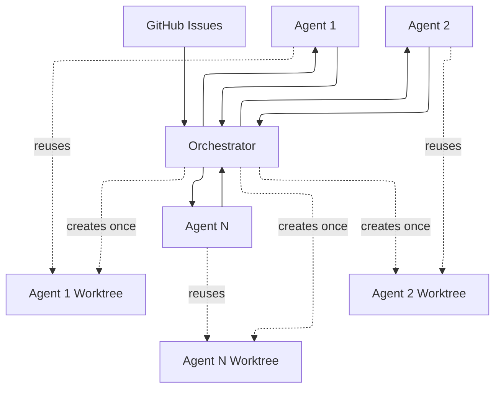
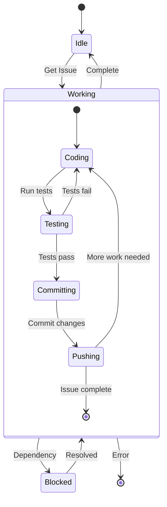
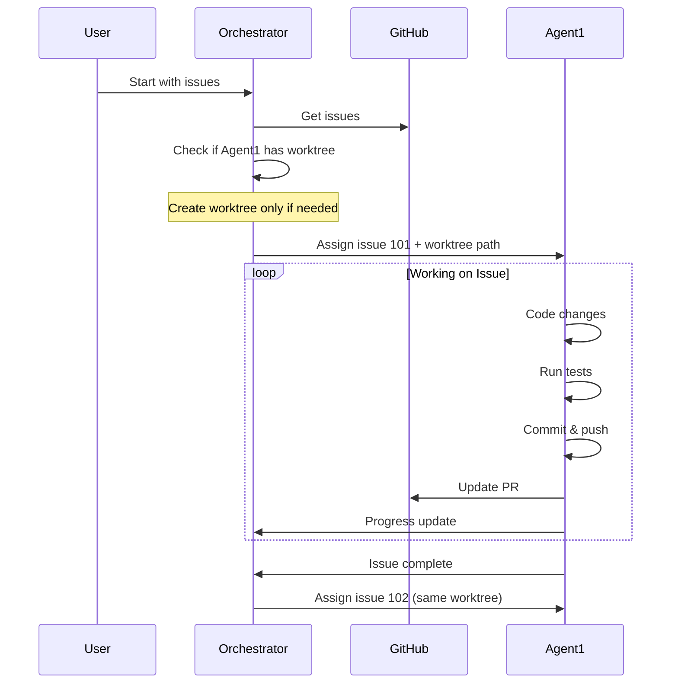
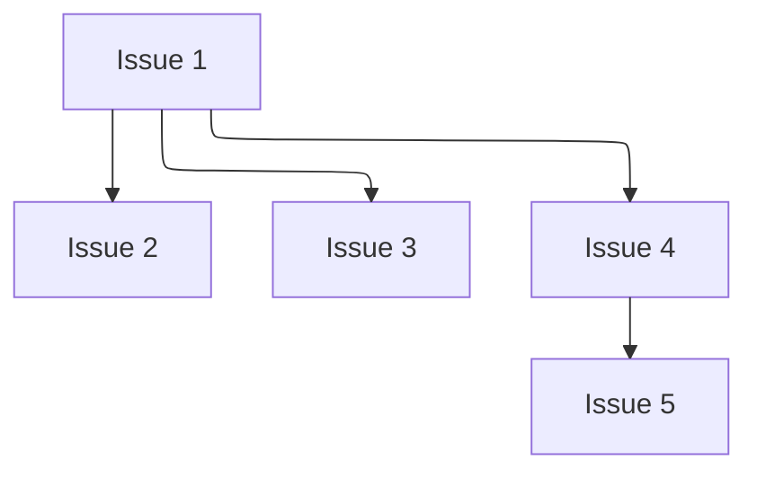
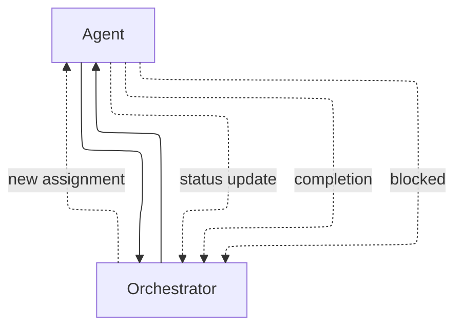
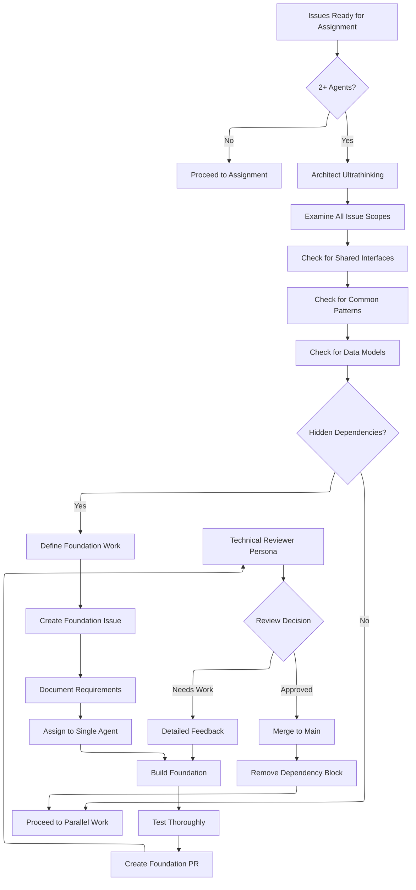
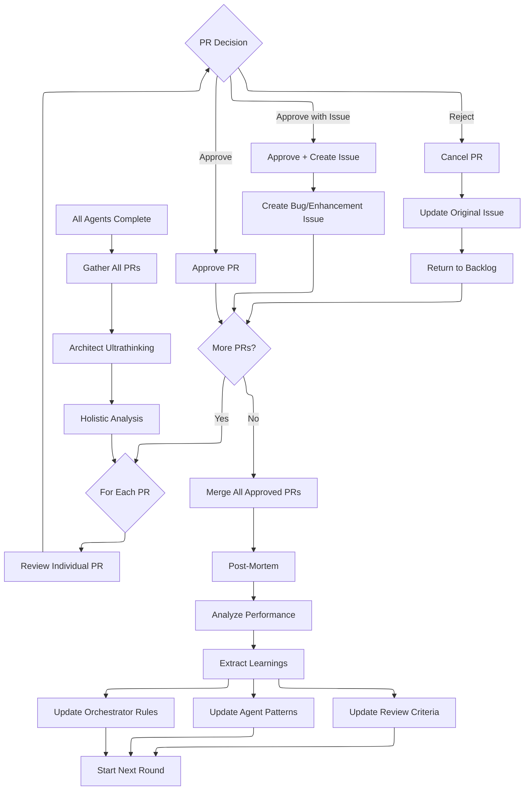
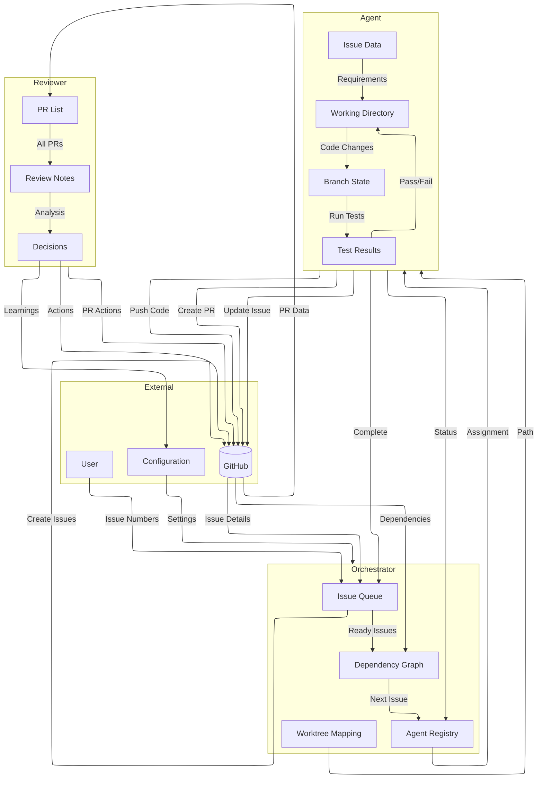
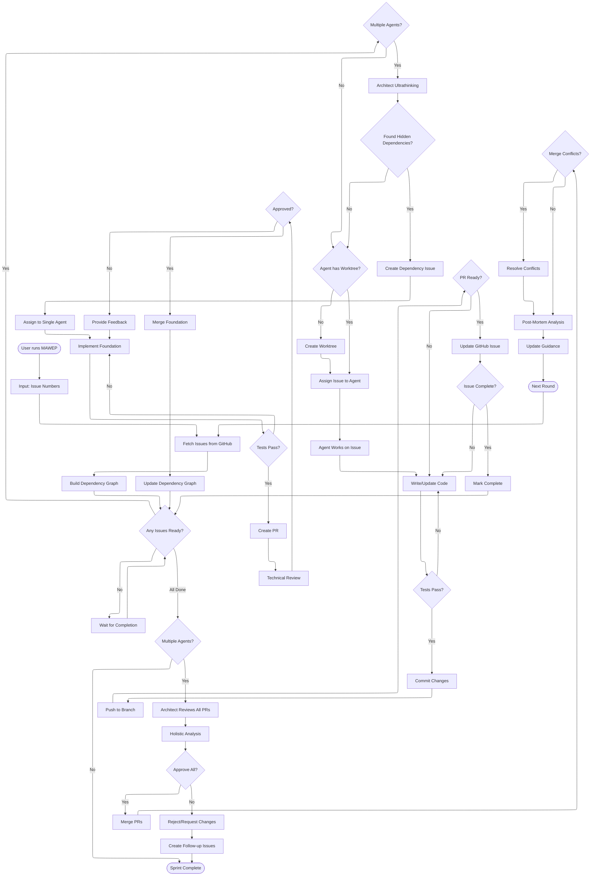

# MAWEP Framework Diagrams

## System Overview

## Agent Lifecycle

## Issue Assignment Flow

## Dependency Graph

## Communication

## Architectural Analysis Phase

## Review and Learning Loop

## Data Flow Diagram (DFD)

## MAWEP Workflow

