# Mermaid Syntax Reference

## Overview

Mermaid is a JavaScript-based diagramming and charting tool that renders Markdown-inspired text definitions to create and modify diagrams dynamically. This reference covers the key diagram types and syntax patterns.

## Important Syntax Rules

### Special Characters to Avoid
- **Never use "end" in lowercase** in flowchart nodes - use "End", "END", or another word
- **Avoid starting node connections with "o" or "x"** - these create special edge types:
  - `A---oB` creates a circle edge
  - `A---xB` creates a cross edge
  - Use `A--- oB` or `A--- xB` (with space) to avoid this

### Entity Codes for Special Characters
Use HTML entity codes to escape special characters:
- `#35;` for # (hash)
- `#59;` for ; (semicolon)
- `#9829;` for ♥ (heart)
- `#quot;` for " (quote)
- `#infin;` for ∞ (infinity)

Example:
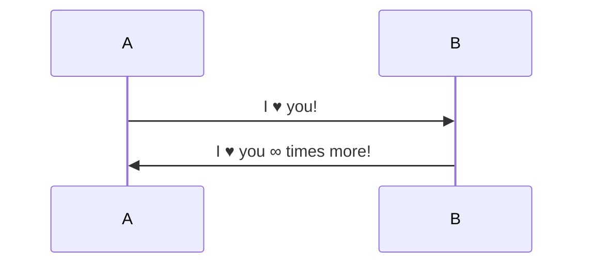

## Flowcharts

### Basic Syntax
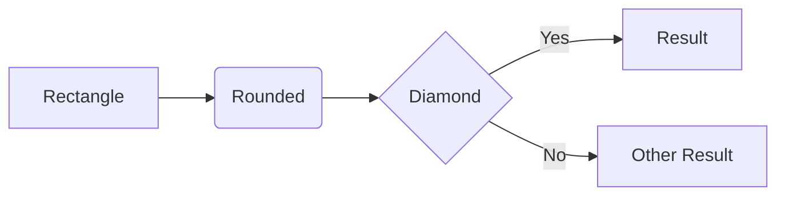

### Directions
- `TB` or `TD` - Top to Bottom
- `BT` - Bottom to Top  
- `LR` - Left to Right
- `RL` - Right to Left

### Node Shapes
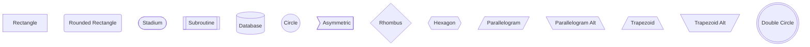

### New Node Shapes (v11.3.0+)
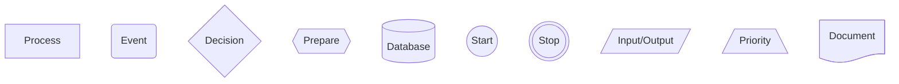

### Link Types
```mermaid
flowchart LR
    A --> B         %% Arrow
    A --- B         %% Open link
    A -.-> B        %% Dotted arrow
    A ==> B         %% Thick arrow
    A ~~~ B         %% Invisible link
    A --o B         %% Circle edge
    A --x B         %% Cross edge
    A <--> B        %% Bidirectional
    A -- text --> B %% Link with text
```

### Subgraphs
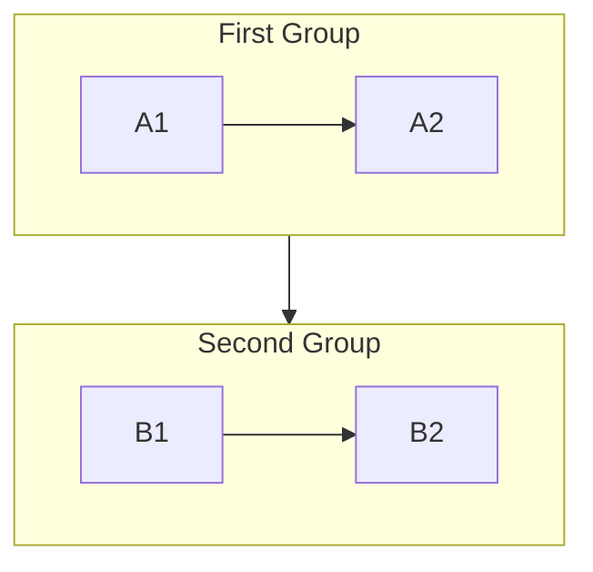

### Markdown in Nodes
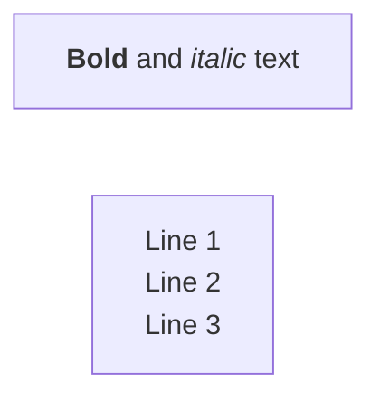

## Sequence Diagrams

### Basic Syntax
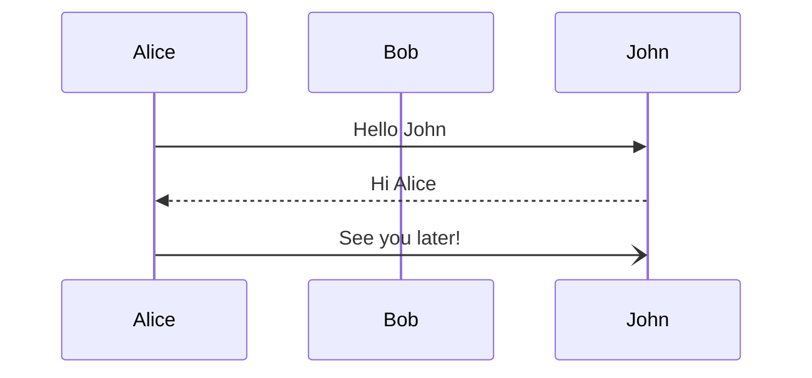

### Message Types
- `->>` Solid line with arrowhead
- `-->>` Dotted line with arrowhead
- `->` Solid line without arrowhead
- `-->` Dotted line without arrowhead
- `-x` Solid line with cross
- `--x` Dotted line with cross
- `-)` Solid line with open arrow

### Activation/Deactivation
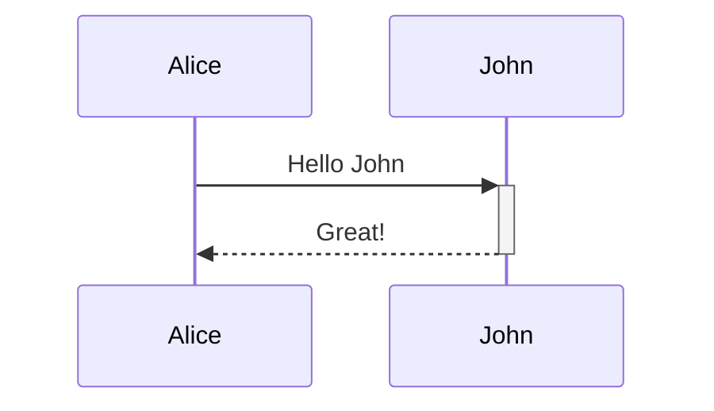

### Loops and Conditions
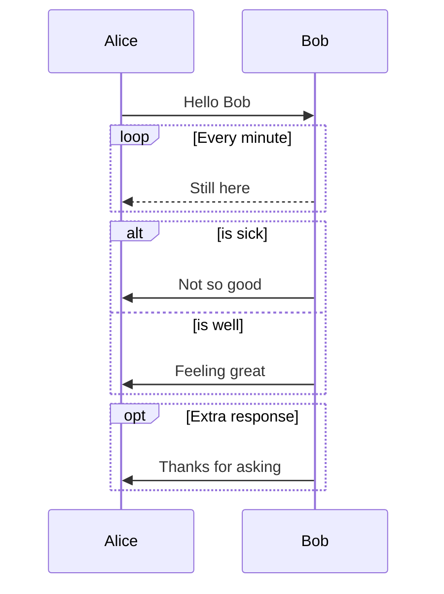

### Parallel Actions
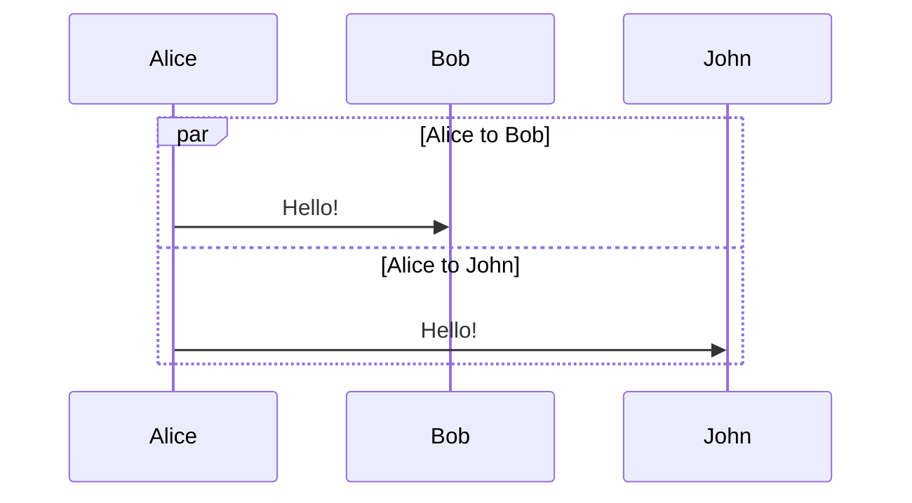

### Critical Regions
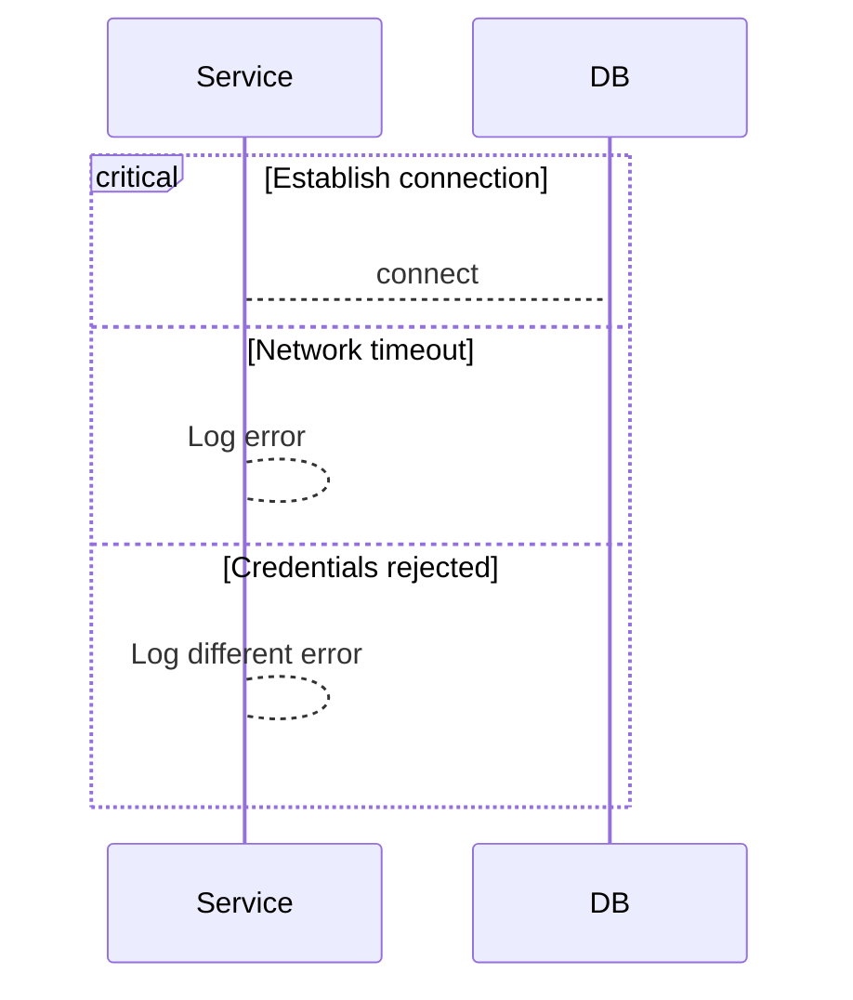

### Background Highlighting
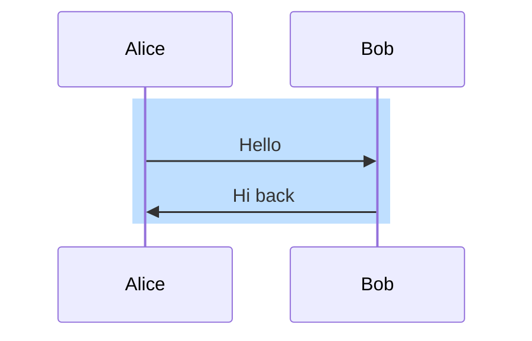

### Notes
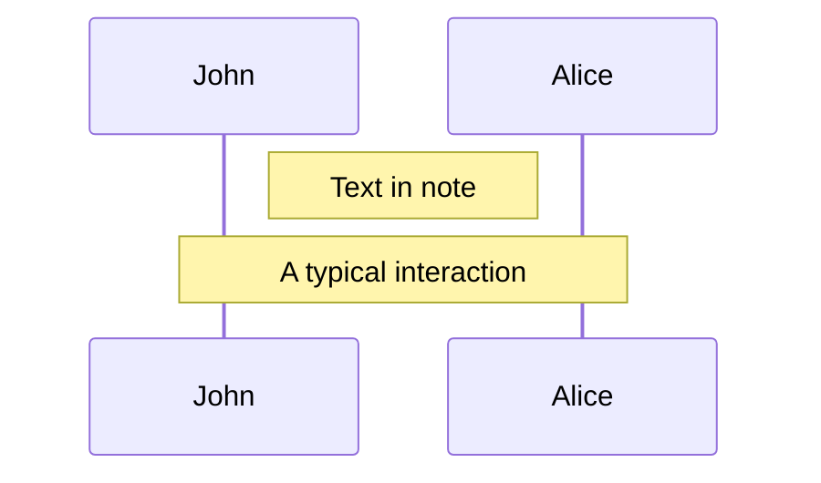

### Auto-numbering
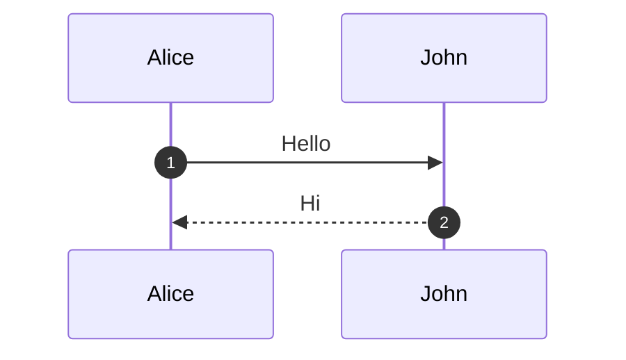

## Entity Relationship Diagrams

### Basic Syntax
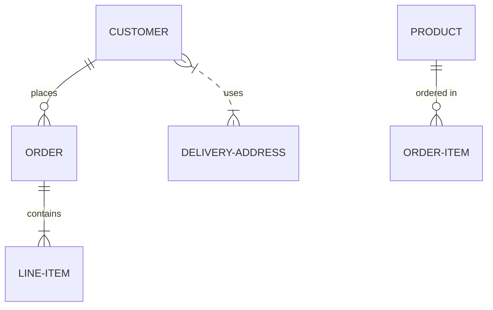

### Relationship Syntax
- `||--||` One to one
- `||--o{` One to many
- `}|..|{` Many to many
- `||--|{` One to exactly one
- `}o--||` Zero or more to one

## State Diagrams

### Basic Syntax
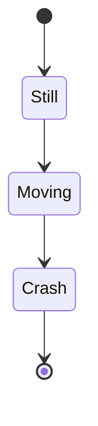

### Composite States
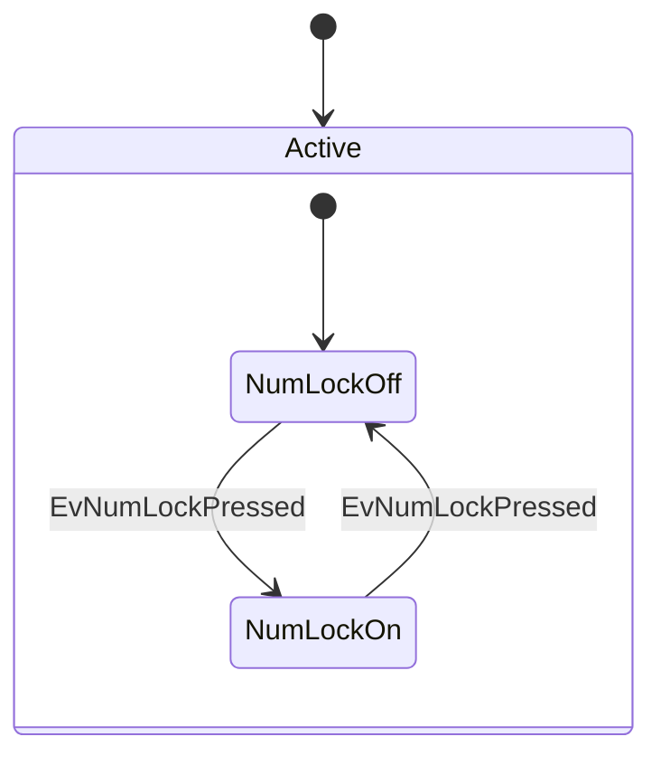

### Parallel States
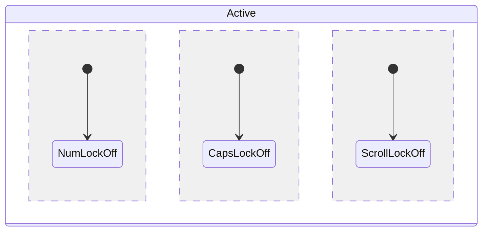

### Fork and Join
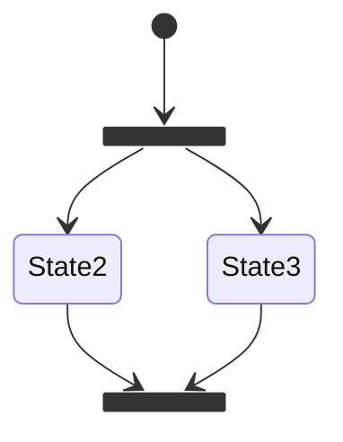

## User Journey Diagrams

### Basic Syntax
```mermaid
journey
    title My working day
    section Go to work
      Make tea: 5: Me
      Go upstairs: 3: Me
      Do work: 1: Me, Cat
    section Go home
      Go downstairs: 5: Me
      Sit down: 5: Me
```

### Format
- Title: Overall journey name
- Section: Major phases
- Task format: `Task name: Score: Actor(s)`
- Score: 1-5 (1=negative, 5=positive)

## Class Diagrams

### Basic Syntax
```mermaid
classDiagram
    class Animal {
        +String name
        +int age
        +makeSound()
        +move()
    }
    class Dog {
        +String breed
        +bark()
    }
    Animal <|-- Dog
```

### Relationships
- `<|--` Inheritance
- `*--` Composition
- `o--` Aggregation
- `-->` Association
- `--` Link (solid)
- `..>` Dependency
- `..|>` Realization

## C4 Diagrams

### Context Diagram
```mermaid
C4Context
    Person(user, "User", "A user of the system")
    System(system, "System", "The system")
    user --> system : Uses
```

## Best Practices

### 1. Use Clear Node IDs
```mermaid
flowchart LR
    Start[Application Start]
    Auth{Authentication}
    Home[Home Screen]
    Start --> Auth
    Auth -->|Success| Home
```

### 2. Organize Complex Diagrams
- Use subgraphs for logical grouping
- Apply consistent naming conventions
- Add descriptive labels to all connections

### 3. Style Guidelines
```mermaid
flowchart TD
    A[Important]
    B[Normal]
    C[Warning]
    
    classDef important fill:#f96,stroke:#333,stroke-width:4px
    classDef warning fill:#ff9,stroke:#333,stroke-width:2px
    
    class A important
    class C warning
```

### 4. Escape Special Characters
Always use quotes for text containing special characters:
```mermaid
flowchart LR
    A["Text with (parentheses)"]
    B["Text with #hash# and ;semicolon;"]
```

### 5. Use Comments
```mermaid
flowchart LR
    %% This is a comment
    A --> B
    %% Another comment
    B --> C
```

## Common Pitfalls to Avoid

1. **Don't use `end` in lowercase** - It breaks flowcharts
2. **Don't start links with `o` or `x`** - They create special edges
3. **Don't use non-alphanumeric characters** in node IDs
4. **Don't forget quotes** around special characters
5. **Don't mix diagram types** in one definition

## Version-Specific Features

### v11.3.0+
- New node shapes with `@{ shape: }` syntax
- Icon support with `@{ icon: }` syntax
- Image support with `@{ img: }` syntax
- Enhanced shape library (30+ new shapes)

### v9.4+
- ELK renderer support for complex diagrams
- Markdown string support in nodes

## Resources
- Official docs: https://mermaid.js.org
- Live editor: https://mermaid.live
- GitHub: https://github.com/mermaid-js/mermaid