# MAWEP Dependency Analysis for mgit Refactoring

## Issue Dependency Graph

```mermaid
graph TD
    subgraph "Group 1: Foundation (Critical Path)"
        1[Issue 1: Package Structure]
    end
    
    subgraph "Group 2: Core Modules (Parallel)"
        2[Issue 2: Logging] --> 1
        3[Issue 3: Config] --> 1
        4[Issue 4: Utils] --> 1
        5[Issue 5: CLI] --> 1
        6[Issue 6: Constants] --> 1
    end
    
    subgraph "Group 3: Provider System"
        7[Issue 7: Provider Interface] --> 1
        8[Issue 8: Azure DevOps] --> 7
        9[Issue 9: Registry] --> 7
        10[Issue 10: Provider Config] --> 7
        10 --> 3
        11[Issue 11: GitHub Stub] --> 7
        11 --> 9
        12[Issue 12: BitBucket Stub] --> 7
        12 --> 9
    end
    
    subgraph "Group 4: Git & Commands (Parallel)"
        13[Issue 13: Git Operations] --> 1
        14[Issue 14: Commands] --> 1
        14 --> 5
        15[Issue 15: Worktree] --> 13
        16[Issue 16: Async] --> 1
    end
    
    subgraph "Group 5: Configuration"
        17[Issue 17: YAML Loader] --> 3
        18[Issue 18: Schema] --> 17
    end
    
    subgraph "Group 6: MAWEP"
        19[Issue 19: Orchestrator] --> 1
        19 --> 15
        20[Issue 20: State] --> 19
        21[Issue 21: CLI] --> 19
        21 --> 14
        22[Issue 22: Communication] --> 19
    end
    
    subgraph "Group 7: Support (Parallel)"
        23[Issue 23: Errors] --> 1
        24[Issue 24: Progress] --> 1
        25[Issue 25: Credentials] --> 1
    end
    
    subgraph "Group 8: Testing"
        26[Issue 26: Pytest] --> 1
        27[Issue 27: Core Tests] --> 26
        28[Issue 28: Provider Tests] --> 26
        28 --> 7
    end
    
    subgraph "Group 9: Final"
        29[Issue 29: Migration] --> 17
        30[Issue 30: Docs] --> 1
    end
```

## Parallelization Strategy

### Sprint 1: Foundation
- **Agent-1**: Issue #1 (Package Structure) - MUST complete first

### Sprint 2: Core Modules (5 parallel agents)
- **Agent-1**: Issue #2 (Logging)
- **Agent-2**: Issue #3 (Config)
- **Agent-3**: Issue #4 (Utils)
- **Agent-4**: Issue #5 (CLI)
- **Agent-5**: Issue #6 (Constants)

### Sprint 3A: Mixed Work (4 parallel agents)
- **Agent-1**: Issue #7 (Provider Interface) - Blocks other provider work
- **Agent-2**: Issue #13 (Git Operations)
- **Agent-3**: Issue #16 (Async Executor)
- **Agent-4**: Issue #23 (Error Handling)

### Sprint 3B: More Parallel Work (3 agents)
- **Agent-1**: Issue #24 (Progress)
- **Agent-2**: Issue #25 (Credentials)
- **Agent-3**: Issue #26 (Pytest Setup)

### Sprint 4: Provider Implementation (5 parallel agents)
After Issue #7 completes:
- **Agent-1**: Issue #8 (Azure DevOps Provider)
- **Agent-2**: Issue #9 (Provider Registry)
- **Agent-3**: Issue #10 (Provider Config) - Also needs #3
- **Agent-4**: Issue #11 (GitHub Stub) - Also needs #9
- **Agent-5**: Issue #12 (BitBucket Stub) - Also needs #9

### Sprint 5: Commands & Git (3 parallel agents)
- **Agent-1**: Issue #14 (Commands) - Needs #5
- **Agent-2**: Issue #15 (Worktree) - Needs #13
- **Agent-3**: Issue #17 (YAML Loader) - Needs #3

### Sprint 6: MAWEP & Config (2 agents)
- **Agent-1**: Issue #19 (MAWEP Orchestrator) - Needs #1, #15
- **Agent-2**: Issue #18 (Config Schema) - Needs #17

### Sprint 7: MAWEP Features (3 parallel agents)
After #19 completes:
- **Agent-1**: Issue #20 (MAWEP State)
- **Agent-2**: Issue #21 (MAWEP CLI) - Also needs #14
- **Agent-3**: Issue #22 (Communication)

### Sprint 8: Testing (2 parallel agents)
- **Agent-1**: Issue #27 (Core Tests) - Needs #26
- **Agent-2**: Issue #28 (Provider Tests) - Needs #26, #7

### Sprint 9: Final Tasks (2 parallel agents)
- **Agent-1**: Issue #29 (Migration) - Needs #17
- **Agent-2**: Issue #30 (Documentation)

## Critical Path Analysis

The critical path is:
1. Issue #1 (Package Structure) - 2 hours
2. Issue #3 (Config) - 2 hours  
3. Issue #17 (YAML Loader) - 3 hours
4. Issue #18 (Schema) - 2 hours
5. Issue #29 (Migration) - 2 hours

**Minimum project duration: ~11 hours** (if critical path is prioritized)

## Optimal Agent Allocation

- **Maximum parallel agents needed**: 5 (during Sprint 2)
- **Average agents needed**: 3
- **Total estimated effort**: ~65 hours
- **Theoretical minimum time with 5 agents**: ~13 hours

## Hidden Dependencies Analysis

### Potential Conflicts:
1. **Config System**: Issues #3, #10, #17, #18 all touch configuration
   - **Risk**: Different config approaches
   - **Mitigation**: Define config architecture in #3

2. **CLI Structure**: Issues #5, #14, #21 all modify CLI
   - **Risk**: Command registration conflicts  
   - **Mitigation**: Define CLI patterns in #5

3. **Provider System**: Issues #7-12 need coordinated design
   - **Risk**: Inconsistent interfaces
   - **Mitigation**: Comprehensive interface in #7

### Recommended Foundation Work:
Before starting parallel development, create a foundation issue for:
- Defining coding standards and patterns
- Creating example implementations
- Setting up CI/CD pipeline

This ensures all parallel work follows consistent patterns.