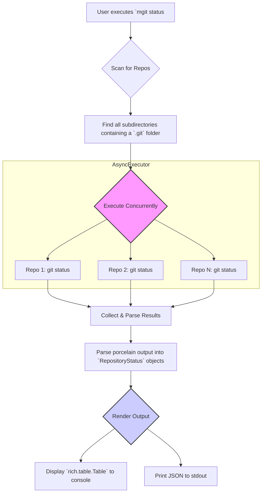

# **`mgit status` - Technical Design Document**

## 1. Feature Overview & Goals

The `mgit status` command provides a high-performance, "mission control" dashboard for the state of all Git repositories within a given directory and its subdirectories.

*   **Goal 1: Instant Workspace Visibility:** Allow developers to get a complete picture of their workspace state with a single command, eliminating the need to manually check individual repositories.
*   **Goal 2: Prevent Lost Work:** Clearly highlight uncommitted changes, untracked files, and branches that need to be pushed, ensuring no work is forgotten.
*   **Goal 3: Enable CI/CD Validation:** Provide a reliable mechanism for automated workflows to verify that a workspace is "clean" before initiating a build or deployment.

## 2. User-Facing Interface (CLI)

The command will be invoked as follows:

```bash
mgit status [PATH] [OPTIONS]
```

### Arguments

| Argument | Description | Default |
| :--- | :--- | :--- |
| `PATH` | The directory to scan recursively for Git repositories. | `.` (Current directory) |

### Options

| Option | Alias | Description | Use Case |
| :--- | :--- | :--- | :--- |
| `--concurrency <N>` | `-c <N>` | Run `N` status checks concurrently. | Speed up checks on large workspaces. |
| `--output <FORMAT>` | `-o <FORMAT>` | Output as `table` (default) or `json`. | Use `json` for scripting and automation. |
| `--show-clean` | `--all` | Show all repositories, not just those with changes. | Get a complete inventory of the workspace's state. |
| `--fetch` | | Run `git fetch` before checking status. | Get an accurate ahead/behind count against the remote. |
| `--fail-on-dirty` | | Exit with an error code (1) if any repo has changes. | Perfect for CI/CD pipeline validation steps. |

## 3. High-Level Architecture & Data Flow

The command's execution follows a clear, multi-stage pipeline, leveraging existing architectural components for concurrency and display.



## 4. Detailed Component Design

### `commands/status.py`
This new file will contain the primary logic.

*   **`status()` function:** This will be the main Typer command function. It will:
    1.  Accept the `PATH` argument and all `OPTIONS`.
    2.  Instantiate a `Path` object and validate it.
    3.  Recursively walk the path to discover all valid Git repositories using `mgit.git.utils.is_git_repository`.
    4.  Create a list of tasks, where each task is a coroutine that will run `git status` on a specific repository.
    5.  Instantiate and run the `AsyncExecutor` with the list of tasks.
    6.  Pass the collected results to a display function.
    7.  If `--fail-on-dirty` is set, exit with code 1 if any repository is not clean.

### Status Parser Logic
The command `git status --porcelain=v1 -b` will be used. The output is stable and machine-readable.

*   **Branch Line:** The first line always starts with `##`.
    *   Example: `## main...origin/main [ahead 1, behind 2]`
    *   It will be parsed with regex to extract:
        *   Local branch name (`main`)
        *   Remote tracking branch (`origin/main`)
        *   Ahead count (`1`)
        *   Behind count (`2`)
*   **File Status Lines:** Subsequent lines have a two-character code.
    *   `XY PATH` where `X` is the status of the index and `Y` is the status of the working tree.
    *   Examples:
        *   ` M README.md`: `M` in the working tree (modified), space in the index (not staged).
        *   `A  new_file.py`: `A` in the index (staged), space in the working tree.
        *   `?? untracked.txt`: Untracked file.
    *   The parser will simply count the number of lines that are not the branch line to determine if there are file changes. A more detailed count per status type can be a future enhancement.

### Data Model
A new `dataclass` will be defined to hold the structured status.

```python
from dataclasses import dataclass, field
from pathlib import Path

@dataclass
class RepositoryStatus:
    path: Path
    is_clean: bool = True
    branch_name: str = ""
    remote_branch: str = ""
    ahead_by: int = 0
    behind_by: int = 0
    modified_files: int = 0
    untracked_files: int = 0
    error: Optional[str] = None
```

### Display Rendering (`rich.table.Table`)
The final table will have the following columns:

| Repository | Branch | Status |
| :--- | :--- | :--- |
| `my-project/api` | `feature/new-auth` | `[yellow]Modified (3), Untracked (1)[/yellow]` |
| `my-project/ui` | `main` | `[red]Ahead (2), Behind (1)[/red]` |
| `my-project/docs` | `main` | `[green]Clean[/green]` |

The "Status" column will be dynamically generated with colors based on the `RepositoryStatus` object's state.

## 5. Error Handling

*   If a subdirectory is not a Git repository, it will be silently skipped.
*   If a `git status` command fails for a specific repository (e.g., corrupted `.git` directory), the `AsyncExecutor` will catch the exception. The final table will display that repository with an "[red]Error[/red]" status and log the detailed error message for debugging. The scan will continue for all other repositories.
