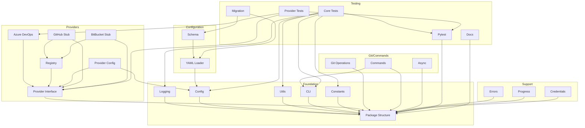

# mgit Refactoring Issues

This document contains all issues needed for refactoring mgit from a monolithic file to a modular architecture with multi-provider support.

## Foundation Issues (No Dependencies)

### Issue #1: Create package structure for mgit
**Type**: Foundation, Refactoring
**Priority**: High
**Labels**: refactoring, foundation

**Description**:
Transform mgit from a single-file application into a proper Python package structure. This is the foundation for all other refactoring work.

**Acceptance Criteria**:
- [ ] Create the following directory structure:
  ```
  mgit/
  ├── __init__.py
  ├── cli.py
  ├── commands/
  │   └── __init__.py
  ├── providers/
  │   └── __init__.py
  ├── git/
  │   └── __init__.py
  ├── config/
  │   └── __init__.py
  └── utils/
      └── __init__.py
  ```
- [ ] Move mgit.py to mgit/__main__.py temporarily
- [ ] Update setup.py or pyproject.toml to reflect new structure
- [ ] Ensure `mgit` command still works after restructuring
- [ ] Add appropriate `__version__` exports

**Dependencies**: None

---

### Issue #2: Extract logging module
**Type**: Foundation, Refactoring
**Priority**: High
**Labels**: refactoring, foundation

**Description**:
Extract all logging configuration and setup from mgit.py into a dedicated module.

**Acceptance Criteria**:
- [ ] Create mgit/logging.py
- [ ] Move MgitFormatter class
- [ ] Move ConsoleFriendlyRichHandler class
- [ ] Move logging setup code
- [ ] Export a setup_logging() function
- [ ] Update imports in __main__.py

**Dependencies**: #1

---

### Issue #3: Extract configuration module
**Type**: Foundation, Refactoring
**Priority**: High
**Labels**: refactoring, foundation

**Description**:
Extract configuration management into a dedicated module.

**Acceptance Criteria**:
- [ ] Create mgit/config/manager.py
- [ ] Move get_config_value() function
- [ ] Move environment variable loading
- [ ] Move config file path logic
- [ ] Create ConfigManager class to encapsulate config logic
- [ ] Update imports in __main__.py

**Dependencies**: #1

---

### Issue #4: Extract utility functions
**Type**: Foundation, Refactoring
**Priority**: High
**Labels**: refactoring, foundation

**Description**:
Create a utilities module for helper functions.

**Acceptance Criteria**:
- [ ] Create mgit/utils/helpers.py
- [ ] Move embed_pat_in_url() function
- [ ] Move sanitize_repo_name() function
- [ ] Move any other utility functions
- [ ] Add comprehensive docstrings
- [ ] Update imports in __main__.py

**Dependencies**: #1

---

### Issue #5: Extract CLI module
**Type**: Foundation, Refactoring
**Priority**: High
**Labels**: refactoring, foundation

**Description**:
Move typer app and command definitions to a dedicated CLI module.

**Acceptance Criteria**:
- [ ] Create mgit/cli.py
- [ ] Move typer app initialization
- [ ] Move version_callback()
- [ ] Move main_options()
- [ ] Move main() and entrypoint()
- [ ] Keep command implementations in __main__.py for now
- [ ] Update imports and entry points

**Dependencies**: #1

---

### Issue #6: Create constants module
**Type**: Foundation, Refactoring
**Priority**: High
**Labels**: refactoring, foundation

**Description**:
Extract all constants into a dedicated module.

**Acceptance Criteria**:
- [ ] Create mgit/constants.py
- [ ] Move DEFAULT_VALUES dictionary
- [ ] Move __version__ constant
- [ ] Add any other magic strings as constants
- [ ] Update imports in all files

**Dependencies**: #1

---

## Provider System Issues

### Issue #7: Create provider interface
**Type**: Provider, Foundation
**Priority**: High
**Labels**: provider, foundation

**Description**:
Define abstract base class for all git providers. This blocks all other provider work.

**Acceptance Criteria**:
- [ ] Create mgit/providers/base.py
- [ ] Define ProviderInterface abstract base class
- [ ] Define methods: authenticate(), list_projects(), list_repositories(), clone_repository()
- [ ] Define repository metadata structure
- [ ] Add comprehensive docstrings
- [ ] Create mgit/providers/exceptions.py for provider-specific exceptions

**Dependencies**: #1

---

### Issue #8: Extract Azure DevOps provider
**Type**: Provider, Refactoring
**Priority**: High
**Labels**: provider, refactoring

**Description**:
Move AzDevOpsManager to implement the provider interface.

**Acceptance Criteria**:
- [ ] Create mgit/providers/azure_devops.py
- [ ] Move AzDevOpsManager class
- [ ] Implement ProviderInterface
- [ ] Update all Azure DevOps imports
- [ ] Maintain backward compatibility
- [ ] Add type hints throughout

**Dependencies**: #7

---

### Issue #9: Create provider registry
**Type**: Provider
**Priority**: Medium
**Labels**: provider

**Description**:
Implement a registry/factory for managing available providers.

**Acceptance Criteria**:
- [ ] Create mgit/providers/registry.py
- [ ] Implement ProviderRegistry class
- [ ] Add register_provider() method
- [ ] Add get_provider() method
- [ ] Auto-discover providers in providers/ directory
- [ ] Handle provider initialization

**Dependencies**: #7

---

### Issue #10: Add provider configuration
**Type**: Provider, Configuration
**Priority**: Medium
**Labels**: provider, configuration

**Description**:
Create provider-specific configuration handling.

**Acceptance Criteria**:
- [ ] Create mgit/providers/config.py
- [ ] Define provider configuration schema
- [ ] Support multiple provider configurations
- [ ] Add provider selection logic
- [ ] Integrate with main config system

**Dependencies**: #7, #3

---

### Issue #11: Create GitHub provider stub
**Type**: Provider
**Priority**: Low
**Labels**: provider, enhancement

**Description**:
Create basic structure for GitHub provider (implementation in future sprint).

**Acceptance Criteria**:
- [ ] Create mgit/providers/github.py
- [ ] Implement ProviderInterface with NotImplementedError
- [ ] Add to provider registry
- [ ] Document required GitHub API scopes
- [ ] Add configuration example

**Dependencies**: #7, #9

---

### Issue #12: Create BitBucket provider stub
**Type**: Provider
**Priority**: Low
**Labels**: provider, enhancement

**Description**:
Create basic structure for BitBucket provider (implementation in future sprint).

**Acceptance Criteria**:
- [ ] Create mgit/providers/bitbucket.py
- [ ] Implement ProviderInterface with NotImplementedError
- [ ] Add to provider registry
- [ ] Document required BitBucket API scopes
- [ ] Add configuration example

**Dependencies**: #7, #9

---

## Git Operations and Commands

### Issue #13: Extract git operations
**Type**: Refactoring
**Priority**: High
**Labels**: refactoring

**Description**:
Move GitManager to a dedicated module.

**Acceptance Criteria**:
- [ ] Create mgit/git/operations.py
- [ ] Move GitManager class
- [ ] Add git worktree support methods
- [ ] Improve error handling
- [ ] Add progress reporting hooks
- [ ] Update imports in __main__.py

**Dependencies**: #1

---

### Issue #14: Create command modules
**Type**: Refactoring
**Priority**: Medium
**Labels**: refactoring

**Description**:
Split CLI commands into separate modules.

**Acceptance Criteria**:
- [ ] Create mgit/commands/clone.py - move clone_all()
- [ ] Create mgit/commands/pull.py - move pull_all()
- [ ] Create mgit/commands/login.py - move login() and store_credentials()
- [ ] Create mgit/commands/config.py - move config()
- [ ] Create mgit/commands/env.py - move generate_env() and gen_env()
- [ ] Update CLI module to import commands

**Dependencies**: #1, #5

---

### Issue #16: Create async executor
**Type**: Enhancement
**Priority**: Medium
**Labels**: enhancement

**Description**:
Centralize async execution logic.

**Acceptance Criteria**:
- [ ] Create mgit/async_utils.py
- [ ] Extract async semaphore logic
- [ ] Create AsyncExecutor class
- [ ] Add progress reporting callbacks
- [ ] Add cancellation support
- [ ] Update GitManager to use AsyncExecutor

**Dependencies**: #1

---

## Configuration System

### Issue #17: Implement YAML config loader
**Type**: Configuration, Enhancement
**Priority**: High
**Labels**: configuration, enhancement

**Description**:
Replace environment variable configuration with YAML files.

**Acceptance Criteria**:
- [ ] Create mgit/config/yaml_loader.py
- [ ] Implement load_config() function
- [ ] Support config.yaml and config.local.yaml
- [ ] Implement config inheritance/override logic
- [ ] Add config file discovery
- [ ] Maintain env var compatibility for migration

**Dependencies**: #3

---

### Issue #18: Create config schema
**Type**: Configuration
**Priority**: Medium
**Labels**: configuration

**Description**:
Define and validate configuration structure.

**Acceptance Criteria**:
- [ ] Create mgit/config/schema.py
- [ ] Define config schema using pydantic or similar
- [ ] Add validation for all config fields
- [ ] Create example config.yaml
- [ ] Add config documentation
- [ ] Add schema versioning

**Dependencies**: #17

---

## Support Modules

### Issue #23: Error handling module
**Type**: Enhancement
**Priority**: Medium
**Labels**: enhancement

**Description**:
Create centralized error handling.

**Acceptance Criteria**:
- [ ] Create mgit/exceptions.py
- [ ] Define custom exception hierarchy
- [ ] Add error codes
- [ ] Add user-friendly error messages
- [ ] Update all modules to use custom exceptions
- [ ] Add error logging

**Dependencies**: #1

---

### Issue #24: Progress reporting module
**Type**: Enhancement
**Priority**: Low
**Labels**: enhancement

**Description**:
Extract and enhance progress reporting.

**Acceptance Criteria**:
- [ ] Create mgit/progress.py
- [ ] Extract Rich progress bar usage
- [ ] Add progress event system
- [ ] Support multiple progress bars
- [ ] Add progress persistence
- [ ] Add ETA calculations

**Dependencies**: #1

---

### Issue #25: Credential storage module
**Type**: Security, Enhancement
**Priority**: High
**Labels**: security, enhancement

**Description**:
Improve credential storage security.

**Acceptance Criteria**:
- [ ] Create mgit/credentials.py
- [ ] Implement secure storage (keyring integration)
- [ ] Add credential encryption
- [ ] Support multiple credentials
- [ ] Add credential validation
- [ ] Migrate existing credential storage

**Dependencies**: #1

---

## Testing and Documentation

### Issue #26: Set up pytest framework
**Type**: Testing
**Priority**: High
**Labels**: testing

**Description**:
Configure pytest and test infrastructure.

**Acceptance Criteria**:
- [ ] Create tests/ directory structure
- [ ] Configure pytest.ini
- [ ] Add test fixtures
- [ ] Set up coverage reporting
- [ ] Add test running to CI/CD
- [ ] Document test running procedures

**Dependencies**: #1

---

### Issue #27: Add unit tests for core modules
**Type**: Testing
**Priority**: Medium
**Labels**: testing

**Description**:
Add comprehensive unit tests for foundation modules.

**Acceptance Criteria**:
- [ ] Test configuration module (80% coverage)
- [ ] Test logging module
- [ ] Test utility functions
- [ ] Test credential storage
- [ ] Add mock fixtures
- [ ] Document test patterns

**Dependencies**: #26, #2-6

---

### Issue #28: Add provider interface tests
**Type**: Testing
**Priority**: Medium
**Labels**: testing, provider

**Description**:
Create tests for provider abstraction.

**Acceptance Criteria**:
- [ ] Test provider interface contract
- [ ] Test provider registry
- [ ] Test Azure DevOps provider
- [ ] Add provider test fixtures
- [ ] Mock API responses
- [ ] Test error scenarios

**Dependencies**: #26, #7-8

---

### Issue #29: Create migration script
**Type**: Migration
**Priority**: Medium
**Labels**: migration, documentation

**Description**:
Help users migrate from old to new configuration.

**Acceptance Criteria**:
- [ ] Create mgit/migrate.py script
- [ ] Detect old .env configuration
- [ ] Convert to new YAML format
- [ ] Backup old configuration
- [ ] Add migration guide
- [ ] Test migration scenarios

**Dependencies**: #17, #18

---

### Issue #30: Update documentation
**Type**: Documentation
**Priority**: Low
**Labels**: documentation

**Description**:
Update all documentation for new architecture.

**Acceptance Criteria**:
- [ ] Update README.md with new structure
- [ ] Update ARCHITECTURE.md
- [ ] Create CONTRIBUTING.md
- [ ] Add API documentation
- [ ] Update CLAUDE.md
- [ ] Add migration guide

**Dependencies**: All others

---

## Dependency Summary



## Parallel Execution Groups

**Group 1 (Foundation)**: Issues #1
**Group 2 (Core Modules)**: Issues #2, #3, #4, #5, #6 (after #1)
**Group 3 (Provider Foundation)**: Issue #7 (after #1)
**Group 4 (Providers)**: Issues #8, #9, #10, #11, #12 (after #7)
**Group 5 (Git/Commands)**: Issues #13, #14, #16 (after #1)
**Group 6 (Config)**: Issues #17, #18 (after #3)
**Group 7 (Support)**: Issues #23, #24, #25 (after #1)
**Group 9 (Testing)**: Issue #26 (after #1), then #27, #28
**Group 10 (Final)**: Issues #29, #30 (after most others)